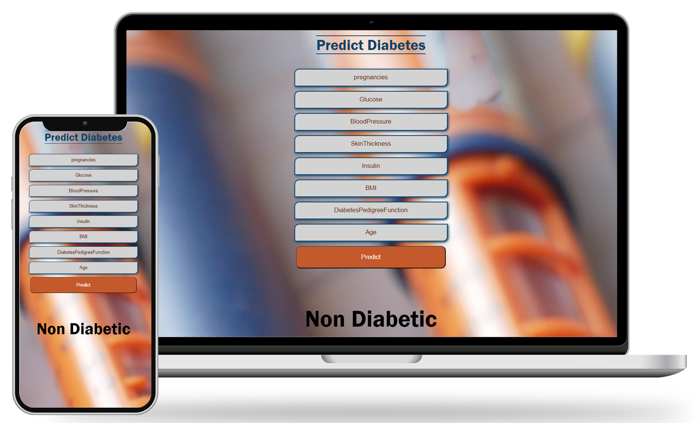
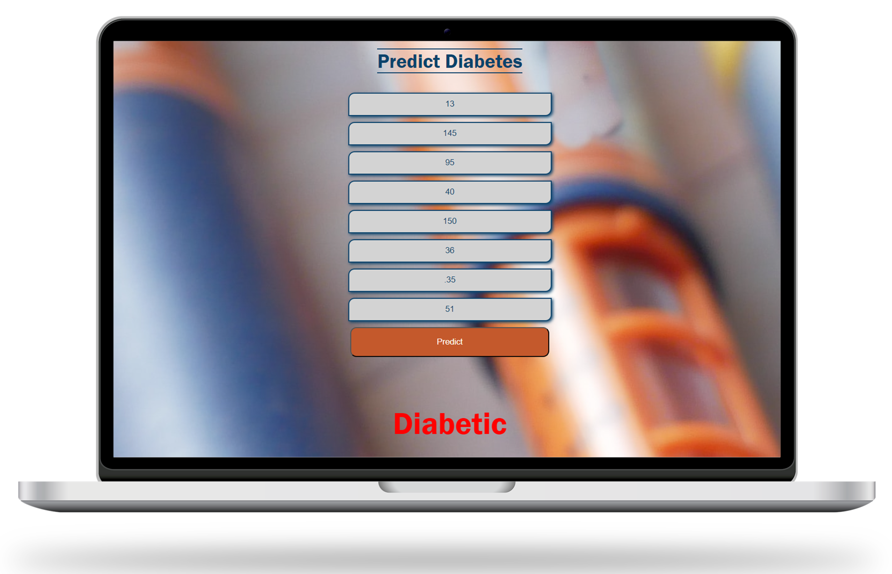

# DIABETES PREDICTION APP USING FLASK , ML AND WEB DEV 🤖🧠🔍📈

---

## A Beautiful Diabetes Prediction Web App using Vanilla JS , Flask and Machine learning 😍

# Different Outputs 📱📲📳

The input can lead to two main outcomes: the person is either diabetic or non-diabetic. Users enter their information into the web app 📝, which is then transformed into a JSON object and sent to the backend Flask server 📤 for evaluation. The server processes this data using a pre-trained SVM model 🧠 and returns the result, indicating whether the person is diabetic or not. The result is then displayed on the screen 📺.

<table style="width:90%">
  <tr>
    <th>
 Diabetic 
 </th>
    <th>
 Non Diabetic  </th> 

  </tr>
  <tr>
    <td>
</td> 

    <td>
</td>

  </td> 
   
  </tr>
</table>

---

## About 💡🎯

🚀 Our full-stack web app leverages Flask and machine learning to predict diabetes status. Users input data, which is transformed into JSON and sent to our backend server. The server utilizes a pre-trained SVM model with 86% training accuracy 📈 and 81% validation accuracy 📊 to evaluate the data and determine if the individual is diabetic or non-diabetic. The data is meticulously preprocessed and scaled for optimal training 🔄. The model and its Jupyter notebook (.ipynb) file are available in the repository 📁. 💻🧠✨

---

## working 💪⚒

- All the information is taken as input from the web app 📝.
- This information is then converted to a JSON object and sent to the backend using a POST request 📤.
- The backend collects all the data and predicts the outcome using a pre-trained model 🧠.
- The output is sent back to the frontend as a response 📩.
- This response is displayed on the screen for the user to see 📺.

---
